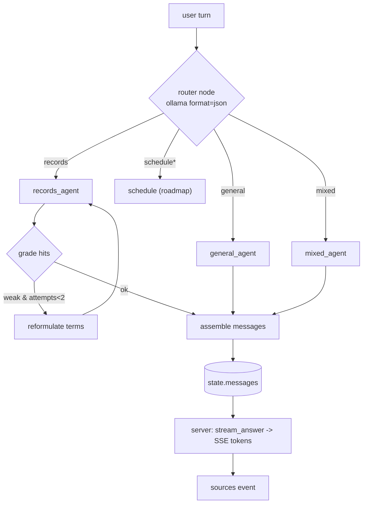

# Plan: Agentic RAG (LangGraph) for the medical-history assistant

## Context

Today the chat is a **fixed single pass**: `expand_query → retrieve → build_messages →
stream_answer` (`core/qa.py`, driven by `app/server.py` `/api/chat`). It can only answer
from the user's own ingested records, with exactly one retrieval. It cannot answer general
medical questions, cannot retry a weak retrieval, and does nothing proactive.

We are re-architecting the chat into a **LangGraph multi-agent system**: a router reads each
turn's intent and dispatches to a specialist branch. The graph orchestrates **routing +
retrieval + retry**; the final natural-language answer is still streamed by the existing
`core.qa.stream_answer`, so the SSE token path and all prompt rules (charts, tables,
disclaimers) stay intact.

**Decisions locked with the user:**
- **Framework: LangGraph.** Not Google ADK / A2A — A2A is for distributed multi-process agents
  (this app is one FastAPI process, one Gemma model, one serialized `MODEL_LOCK`); ADK's value
  is LLM-driven tool-calling, which Gemma is weak at and which this design deliberately avoids.
- **Gemma's weak tool-calling is sidestepped:** routing is **explicit graph edges**, and
  structured steps (router, follow-up extraction) use the existing `ollama` client with
  `format='json'` — **no `langchain-ollama`** (nodes call `ollama` directly, matching the rest
  of the codebase). LangGraph pulls `langchain-core` transitively; that is the only new core dep.
- **General medical knowledge = Gemma's parametric knowledge only.** No PubMed/web. Nothing
  leaves the device to answer a question.
- **Human-in-the-loop confirmation = unified pending-reminders REST** (recommended default;
  see "Scheduling roadmap"). The chat route holds `MODEL_LOCK` for the entire SSE stream
  (`server.py:197-268`) and **cannot** hold it across a human approval, so we do **not** use a
  LangGraph checkpointer/`interrupt()`. Proposals are persisted and approved via dedicated
  endpoints — the same mechanism for "remind me…", medication-capture, and follow-up flows.

## Scope of this PR

This PR delivers the **agentic-RAG core** (the "make it agentic" deliverable): the LangGraph
router → records (with a bounded retry cycle) / general / mixed, wired into `/api/chat` with
streaming preserved. Scheduling, Google Calendar, the medicine index, and medication capture
are specified in the **Roadmap** section below as follow-up PRs, not built here.

## Architecture



`*` schedule branch is roadmap-only in this PR; router may still emit the `schedule` intent
but the server treats it as `records` until the scheduling PR lands.

### State — `core/agent/state.py` (TypedDict)
`question: str`, `history: list[dict]`, `intent: str`,
`vector_text: str`, `keywords: list[str]`, `is_value_query: bool`,
`date_range: tuple[int,int] | None`, `hits: list[tuple]`, `retrieval_attempts: int`,
`messages: list[dict]`, `sources: list[dict]`.

The graph's job is to populate `messages` + `sources`; the server streams from there.

### Nodes — `core/agent/nodes.py` + `core/agent/router.py`
- **router** (`router.py`) — one `ollama.chat(..., think=False, format='json', options={'num_ctx': CHAT_NUM_CTX, 'temperature': 0.0, 'num_predict': 64})` call returning
  `{"intent": "records|general|mixed|schedule|clarify"}`. New prompt `ROUTER_PROMPT` modeled
  on the style of `EXPANSION_PROMPT` (`core/qa.py:76`) but classifying **scope** (is this about
  the user's own records, general medical knowledge, both, a scheduling request, or unclear),
  which is orthogonal to `expand_query`'s existing `values|general` axis. Degrades to `records`
  on any parse failure (preserves today's behavior). For this PR, `schedule` and `clarify` both
  fall through to `records`.
- **records_agent** — reuse `core.qa.expand_query` then `core.qa.retrieve` verbatim. Writes
  `hits`, increments `retrieval_attempts`.
- **grade** (conditional edge function) — if `hits` is empty/weak (e.g. `< 2` fused hits and
  `vector_store.count() > 0`) **and** `retrieval_attempts < 2`, route to **reformulate**;
  else to **assemble**.
- **reformulate** — one `ollama` json call producing alternate/broader search terms; rebuild
  `vector_text`/`keywords`, loop back into `records_agent` (this is the multi-hop / retry
  capability — a real LangGraph cycle, capped at 2 total attempts to bound laptop latency).
- **general_agent** — no retrieval; sets `messages` from a new `GENERAL_SYSTEM_PROMPT`
  (general medical info from Gemma's weights, keep the educational disclaimer, no charts unless
  illustrative). `sources = []`.
- **mixed_agent** — runs records retrieval (single hop) then assembles **one** prompt that
  combines the retrieved excerpts with a "you may also use general medical knowledge to
  interpret" instruction, so personal values + general interpretation are synthesized in a
  single `build_messages`-style prompt. Keeps `sources` from the hits.
- **assemble** — for records: `build_messages(question, hits, history)` (reuse
  `core/qa.py:323`) → `messages`; `sources_from_hits(hits)` → `sources`. For general/mixed the
  agent builds `messages` directly. Always reuses `format_context` where excerpts are involved.

### Graph — `core/agent/graph.py`
`build_graph()` constructs a `StateGraph`, compiles **once** at import/startup (no checkpointer),
and exposes `run_turn(question, history) -> {messages, sources, intent}` that invokes the
compiled graph synchronously (it's all `ollama` calls under `MODEL_LOCK`). Nodes never stream;
they only produce `messages`. Streaming stays in the server.

## Files

### New — `core/agent/`
| Path | Purpose |
|---|---|
| `core/agent/__init__.py` | exports `run_turn` |
| `core/agent/state.py` | `AgentState` TypedDict |
| `core/agent/router.py` | `ROUTER_PROMPT`, `classify_intent(question, history) -> str` |
| `core/agent/nodes.py` | node fns + `GENERAL_SYSTEM_PROMPT`; reuses `core.qa` helpers |
| `core/agent/graph.py` | `build_graph()`, compiled singleton, `run_turn(...)` |

### Modify — `app/server.py` (`/api/chat`, lines 185-274)
Replace the inline `expand_query → retrieve → build_messages` block (lines 209-218) with a
single `state = await asyncio.to_thread(run_turn, req.message, history)` call, still inside the
existing non-blocking `MODEL_LOCK` acquire. Then:
- emit a `status` SSE event per major step (e.g. `{"step": "routing"|"searching"|"retrying"|"answering"}`) — add a tiny `_sse('status', {...})` (helper already at `server.py:181`);
- stream the final answer with `stream_answer(state['messages'])` — **unchanged token loop**
  (lines 221-248);
- emit `sources` from `state['sources']` (replacing `sources_from_hits(hits)` at line 250);
- history append/trim (lines 252-255) stays, using the user message from `state` (have
  `assemble` also return the stored user-message string, mirroring `build_messages`'s 2-tuple).

The lock handling, cancellation path, and empty-answer guard are untouched.

### Modify — `pyproject.toml`
Add `langgraph` (brings `langchain-core` transitively). Add `pytest` to a dev/optional group
for the new unit tests. Run `uv lock` / `uv sync`.

### New — `tests/` (pytest)
- `tests/test_router.py` — `classify_intent` on a fixed question set (records / general /
  mixed), mocking `ollama.chat` to return canned json. Asserts the routing.
- `tests/test_agent_flow.py` — with `ollama` + `vector_store` mocked, assert: a weak first
  retrieval triggers exactly one reformulate+retry then assembles; a strong retrieval assembles
  immediately; general intent produces `messages` with `sources == []`.

## Verification (end-to-end)
- Run: `uv run uvicorn app.server:app --host 127.0.0.1 --port 8000`.
- **Routing:** "what does high CRP mean" → answered with **no** sources (general);
  "what was my CRP in May" → records answer **with** sources; "is my CRP of 12 high?" → mixed
  (personal value + general interpretation, sources present). Confirm via the chat UI and the
  server logs.
- **Retry:** ask something phrased to miss on first retrieval; confirm in logs that a second
  reformulated search runs (a `retrying` status event + a second `retrieve`) before the answer.
- **Streaming intact:** tokens stream as before; a multi-date value question still renders the
  ```chart``` block (frontend unchanged).
- **Regression:** an ordinary records question behaves exactly as today (single hop, sources).
- **Unit:** `uv run pytest`.

## Notes / risks
- **Latency:** every hop is a full Gemma pass on the laptop. Keep simple records/general turns
  to a single hop; the retry cycle is hard-capped at 2 attempts. The router call is `num_predict`-
  capped like `expand_query` already is (`core/qa.py:178`).
- **Streaming stays out of the graph:** nodes only build `messages`; the server streams. If
  intermediate-agent token streaming is ever wanted, switch to `graph.astream_events(version='v2')`
  — explicitly out of scope here.
- **Graceful degradation:** router/reformulate failures fall back to plain records retrieval, so
  the agentic layer can never make chat worse than today.
- **Model unchanged:** keep `CHAT_MODEL=gemma4:26b` served by Ollama as-is. Ollama already runs
  the model from a GGUF in its own store; no separate `.gguf` handling is introduced by this PR.

---

## Roadmap (follow-up PRs — specified, not built here)

These were part of the original draft and are kept for context; each is its own PR.

### PR 2 — Scheduling + Google Calendar (unified pending-reminders REST)
- `core/reminders.py` (stdlib `sqlite3` under `rag_db/`): `pending_reminders` table
  `(id, kind, title, proposed_text, start, rrule, status, gcal_event_id, created_at)`.
- `core/calendar.py`: Google Calendar OAuth desktop flow (refresh token under `rag_db/`),
  `create_reminder(title, start, rrule, ...)` building RRULE from frequency+tenure, popup
  notifications. **Privacy:** medication titles truncated to **first 4 chars**; follow-up titles
  are the **user-approved** text only.
- `scheduling` graph node: builds a proposal, persists to `pending_reminders`, emits an SSE
  `proposal` event (no `interrupt`, no lock held across approval).
- `app/server.py` routes: `GET /api/reminders`, `POST /api/reminders/{id}/confirm`
  (edit/approve → `core.calendar.create_reminder`), Google OAuth callback routes.
- Deps: `google-api-python-client`, `google-auth`, `google-auth-oauthlib`.
- UI: reminder-confirmation panel (edit text before it goes to Google).

### PR 3 — Medicine index + medication capture
- `scripts/build_medicine_index.py` (needs internet **once** at dev time): India CSV
  (junioralive/Indian-Medicine-Dataset) + RxNorm `RXNCONSO.RRF` → bundled sqlite FTS index.
- `core/medicines.py`: `search(prefix)` autocomplete + brand→generic normalization.
- `core/med_store.py`: `(med_name, dosage, frequency, tenure, start_date, source_doc_id,
  gcal_event_id)` — enables cancellation + "active meds" queries.
- Routes: `GET /api/medicines?q=`, `POST /api/medications`.
- UI: post-prescription medication-capture screen (autocomplete, per-med dosage/frequency/
  tenure, Skip) → per-med reminders (4-char names).

### PR 4 — Follow-up extraction on prescription ingest
- In `app/jobs.py:_process` (already inside `MODEL_LOCK`), after a **prescription** ingest run
  a small Gemma `format='json'` extraction over the analysis text (e.g. "repeat HRCT in 6
  months") → write proposals into `pending_reminders` (status `pending`, **not** auto-scheduled —
  background jobs can't prompt the user). Surfaced for approval via `GET /api/reminders`.

### Config (when roadmap PRs land)
`core/config.py` + `.env.example`: Google creds/token paths, calendar id, medicine index path.

### Privacy boundary (must hold in code)
- Answering: no network calls (Gemma + local store only).
- Google Calendar is the **only** outbound path: med titles → first 4 chars; follow-up titles →
  user-approved text. Never send dosage notes, file names, or record excerpts to Google. Log the
  outbound Calendar payload in dev to verify.
